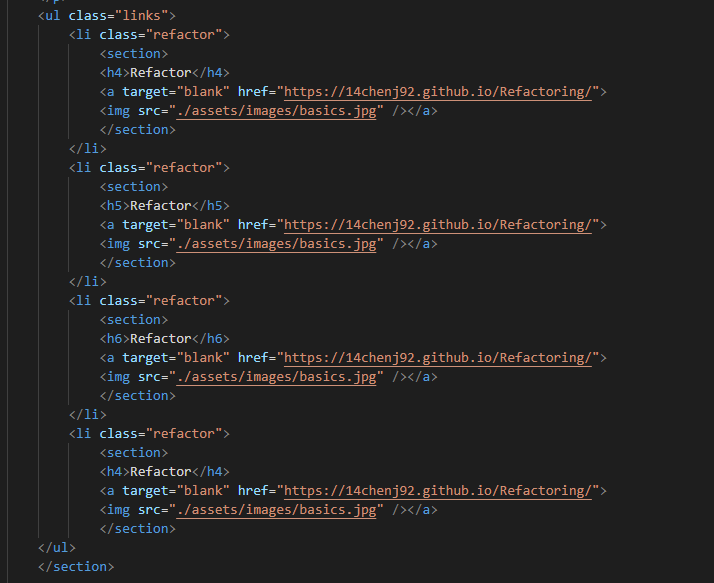
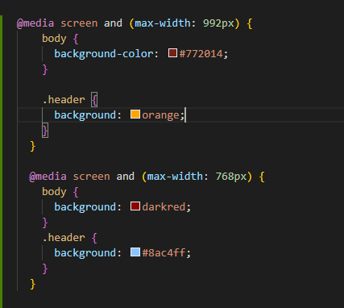

# Portfolio

## Description
The goal for this repository was create a portfolio from scratch so I could utilize it for future use. Having a portfolio that showcases your projects is very important
for finding a job. I created an index that uses semantic elements and a css file that stylized the page to my preferences. I broke down my portfolio in 3 parts: about me, 
list of projects, and contacts. I plan to consistently update my portfolio once I finish more projects. 

The first screenshot shows how I formatted the links to my projects. I used the same links as placeholders.  

The following screenshot shows how used media query screens to change the background colors of my page. 

Here is the link to the application page:
https://14chenj92.github.io/Portfolio/

## Installation
N/A

## Usage
N/A

## Credits
Jonathan Chen